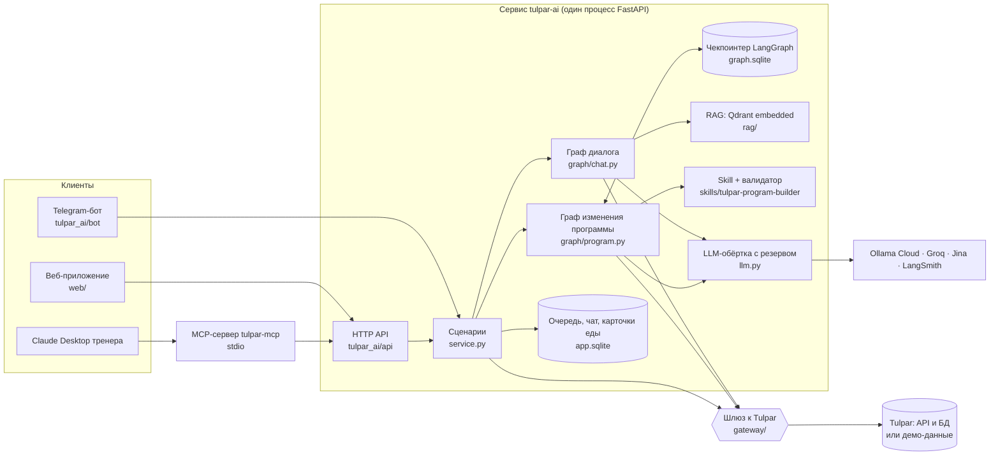
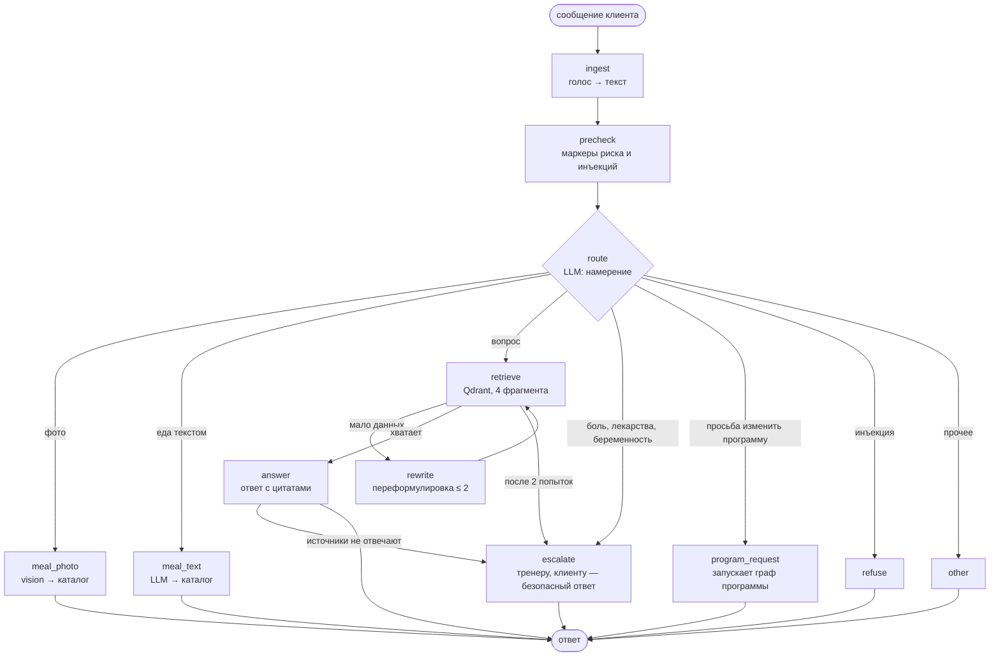

# Архитектура Tulpar AI Coach

AI-слой поверх фитнес-платформы Tulpar. Главный принцип: **агент предлагает, человек решает**. Модель отвечает клиенту, считает еду и готовит черновики изменений программы, но менять программу может только тренер — одним нажатием в вебе или в Telegram.

## Граница проекта

| Было в Tulpar до финального проекта | Сделано в финальном проекте (этот репозиторий) |
|---|---|
| Продукт для клуба, тренера и клиента: программы, дневник питания, каталог упражнений и продуктов | Агентный слой: два графа LangGraph, пауза на решение тренера, очередь |
| Распознавание еды по фото в два шага и реестр моделей с резервными (в коде Tulpar) | Свой мультимодальный пайплайн: фото и голос входят в граф, распознавание связано с каталогом и дневником |
| Размеченный бенчмарк на 80 фото еды | MCP-сервер `tulpar-mcp`, Skill `tulpar-program-builder` с валидатором |
| | RAG по упражнениям, правилам питания и PDF ВОЗ 2020 с цитатами |
| | Евалы, A/B, подбор гиперпараметров, трейсинг LangSmith, веб-интерфейс, Telegram-бот |

Код Tulpar не менялся. С продуктом проект связан через один слой-шлюз (`tulpar_ai/gateway`).

## Компоненты

| Компонент | Файлы | Чем заменяется |
|---|---|---|
| Шлюз к Tulpar | `gateway/base.py`, `demo.py`, `tulpar.py` | Демо-режим на выгрузке из сидов Tulpar или реальный режим для локального стенда. Остальной код не знает, какой режим включён |
| Чекпоинтер | `graph/runner.py` | `AsyncSqliteSaver` → `PostgresSaver` одной строкой |
| Векторная БД | `rag/index.py` | Qdrant во встроенном режиме → Qdrant Cloud заменой пути на URL |
| Эмбеддинги и реранкер | `rag/embed.py` | Jina → локальный запасной вариант; реранкер: `RAG_RERANK=auto` — включён для локального поиска, выключен для Jina; другой провайдер — один класс |
| LLM | `llm.py`, цепочки в `.env` | Ollama Cloud → Groq автоматически при сбое; порядок меняется без кода |
| Промпты | `prompts/*.v1.md` | Версии файлами, активная задаётся в коде или env |
| Правила программ | `skills/tulpar-program-builder` | Один источник правды для графа и для Claude |

## Граф диалога: один ход клиента

**Где ветвления:** `route` — семь направлений; `retrieve` — ответ, переформулировка или эскалация; `answer` — ответ или эскалация, если модель сама признала, что источники не отвечают.
**Где цикл:** `retrieve → rewrite → retrieve`, не больше двух переформулировок. Критерий «данных хватает» — оценка лучшего фрагмента после реранкера, без лишнего вызова LLM.
**Безопасность до модели:** `precheck` ищет жёсткие маркеры (стероиды, рвота, «не ем N дней», беременность, обморок) — они всегда ведут к тренеру, что бы ни ответила модель. Мягкие маркеры («болит», «таблетки») только подсказывают маршрутизатору. Попытки инъекции отклоняются до вызова LLM.

## Граф изменения программы: пауза на решение тренера

**Human-in-the-loop.** Узел `review` содержит только `interrupt()`. При возобновлении LangGraph перезапускает прерванный узел с начала, поэтому всё с побочными эффектами — вызовы LLM, запись в очередь, уведомления — вынесено в другие узлы. `apply` идемпотентен: повторное «принять» видит статус `applied` и ничего не делает. Тест `tests/test_program_resume.py` закрывает соединение с чекпоинтером посреди паузы, открывает новое и принимает черновик — правка применяется один раз.
**Два цикла:** валидатор возвращает черновик на переработку с кодами ошибок (до трёх черновиков), комментарий тренера возвращает черновик с правками (до двух раундов).
**Правки, а не новый план.** Агент меняет активный план операциями `replace_exercise`, `set_volume`, `remove_exercise`, `add_exercise`. Перед применением сохраняется снимок, при ошибке правки откатываются. Создавать новый план цепочкой запросов нельзя: в Tulpar это неатомарно, план сразу становится активным и клиенту уходит уведомление.

## Путь одного запроса

Клиент пишет в бот: «Тренер знает про колено. Замените, пожалуйста, присед на что-то щадящее».
1. Бот вызывает `service.chat_turn` → граф диалога. `precheck` не находит жёстких маркеров, мягкий маркер «колено» не найден (нет «болит»).
2. `route` (роль `route`, temperature 0) возвращает `program_request`.
3. `program_request` создаёт запись в очереди со статусом `drafting`, запускает граф программы в фоне и сразу отвечает клиенту: «Передал тренеру».
4. Граф программы: `load_context` берёт через шлюз профиль, заметку тренера «колено», активный план и подбирает кандидатов без противопоказаний по колену и с допустимым инвентарём.
5. `draft` (роль `text`, temperature 0.2): системный промпт — инструкция Skill и справочники; ответ — JSON с операциями.
6. `validate` запускает тот же `validate_plan.py`, что и Claude в песочнице. Если модель выбрала упражнение с противопоказанием по колену, будет `E_CONTRAINDICATION` и новый черновик.
7. `publish` ставит статус `pending`, тренер получает сообщение с таблицей «было → станет» и кнопками.
8. Тренер нажимает «Принять» → `resume` → `apply` меняет план через шлюз → клиент получает уведомление.
Весь путь — один трейс `program_change` в LangSmith с вложенными вызовами LLM, retriever и инструментов.

## Решения и альтернативы

- **Почему LangGraph.** Ключевое требование — пауза на решение тренера, которая живёт часами и переживает перезапуск сервиса. В LangGraph это `interrupt` и чекпоинтер из коробки, а граф с ветвлениями и циклами описан явно и рисуется в диаграмму. CrewAI строится вокруг ролей агентов и задач, а нам нужен детерминированный поток с точками решения. Parlant силён в диалоговых правилах поведения, но у нас основная ценность в процессе «черновик → проверка → решение человека».
- **Где здесь агент.** Решения принимает модель: маршрут сообщения, достаточность найденного (через переформулировку), состав правок программы и их исправление по замечаниям валидатора и тренера.
- **Почему MCP, а не обычный API.** Тренер уже работает в Claude Desktop. MCP даёт ему те же возможности, что веб и бот, как типизированные инструменты, которые любой MCP-клиент находит и вызывает сам. Скоуп тренера и маскирование данных остаются в одном месте — в сервисе. С обычным API под каждый ассистент пришлось бы писать свою обвязку.
- **Когда Skill лучше промпта.** Правила программ версионируются отдельно от кода, подгружаются по триггеру, а справочники и скрипт — по необходимости. Главное: проверка идёт детерминированным скриптом, а не инструкцией «будь внимателен». Один артефакт используют и граф, и Claude. Честно: в графе Skill загружается упрощённо — текст инструкции идёт в системный промпт.
- **Что потерялось бы без мультимодальности.** Клиент в зале не будет набирать «плов 300 г». Фото и голос — единственный реальный способ вести дневник питания, а дневник, который заполняют руками, бросают за неделю.
- **Почему SQLite для чекпоинтов и очереди.** Postgres на Railway общий с продом Tulpar, а чужие таблицы в его базе ломают проверку миграций. Цена решения — один экземпляр сервиса. Замена на Postgres — одна строка.
- **Почему еда ищется не векторами.** Каталог продуктов — справочник с точными названиями; токенное сходство названий точнее эмбеддингов и объяснимо: у каждой цифры есть строка каталога.
- **Почему embedded Qdrant.** Корпус небольшой, отдельный сервис не нужен, а API тот же, что у Qdrant Cloud.

## RAG

| Источник | Объём | Разбиение | Почему так |
|---|---|---|---|
| `corpus/exercises.jsonl` | 196 карточек упражнений на русском | одна карточка — один фрагмент | карточка — законченный ответ: техника, польза, противопоказания |
| `corpus/nutrition.md` | правила питания Tulpar | по заголовкам, затем по абзацам | правила короткие и атомарные |
| `corpus/who_2020_physical_activity.pdf` | рекомендации ВОЗ 2020, 104 страницы, английский | постранично, куски ~400 символов с перекрытием 120 | номер страницы сохраняется для цитаты; 400 выбрано экспериментом вместо 800 |

Эмбеддинги `jina-embeddings-v3` — многоязычные: вопрос на русском находит английский текст ВОЗ (без них — 0% попаданий на таких вопросах, с ними — 58%). Поиск: 4 лучших фрагмента из Qdrant. Реранкер `jina-reranker-v2-base-multilingual` реализован, но для Jina выключен по результату A/B: с многоязычными эмбеддингами он не улучшил попадания (84,3% без него против 80,4% с ним), а добавил 1,6 с и ещё одну зависимость с жёстким лимитом запросов. Без ключа Jina работает локальный запасной вариант на хешированных n-граммах с лексическим реранкером — там реранкер помогает, и это базовая линия в евалах.

## Модели и стоимость

| Роль | Основная модель | Резерв | Параметры |
|---|---|---|---|
| route — маршрут сообщения | Ollama Cloud `minimax-m3` | Groq `openai/gpt-oss-20b` | temperature 0, max_tokens 200 |
| text — ответы | Ollama Cloud `minimax-m3` | Groq `openai/gpt-oss-120b` | t 0, top_p 0.9, max_tokens 400 |
| text — черновики программ | Ollama Cloud `minimax-m3` | Groq `openai/gpt-oss-120b` | t 0.2, top_p 0.9, max_tokens 1500 |
| vision — фото еды | Ollama Cloud `kimi-k2.7-code` | `kimi-k2.6`, затем `minimax-m3` | t 0, max_tokens 300 |
| judge — оценка в евалах | Ollama Cloud `qwen3.5:397b` | Groq `openai/gpt-oss-120b` | t 0 |
| распознавание голоса | Groq `whisper-large-v3-turbo` | — | язык ru |

Выбор подтверждён A/B на 80 размеченных фото: `kimi-k2.7-code` верно называет главное блюдо в 72,5% снимков и 16 из 20 блюд казахской кухни, `minimax-m3` — 63,8% и 14 из 20, зато честно отказывается на фото без еды в 83% случаев против 58%. Основной — `kimi-k2.7-code`, потому что выдуманное блюдо на фото без еды клиент просто не запишет, а неузнанное настоящее блюдо — потерянная запись в дневнике. Ollama Cloud — подписка, уже работающая в продукте, поэтому нет проблемы с оплатой из Казахстана. Судья в евалах — модель другого семейства, чтобы не оценивать себя самой; Groq используется как резерв, а не основной судья, потому что бесплатный лимит Groq закончился бы посреди прогона и смешал бы оценки двух судей. max_tokens ответа выбран по прогону: 95-й процентиль длины ответа 225 токенов, максимум 259, лимит 400 даёт запас без обрезанных ответов. Значения гиперпараметров и стоимость одного запроса подтверждаются экспериментами в [EVALS.md](EVALS.md).

**Если основная LLM недоступна или подорожала:** `llm.py` идёт по цепочке провайдеров для роли, резерв отмечается в трейсе `fallback_used`. Порядок моделей меняется переменными окружения без деплоя кода. Если недоступны все, маршрутизация переходит на детерминированные правила, а вопросы уходят тренеру — сервис не падает.

## Данные и безопасность

- Модель не видит имя, телефон, e-mail и ИИН клиента: `pii.py` маскирует их до вызова, контекст клиента для модели обезличен (`ClientContext.for_llm`).
- Медицинские справки и фото тела не принимаются; боль, травмы, лекарства, беременность и расстройства питания уходят тренеру без совета.
- Ответы с фактами идут только по источникам с цитатами и дисклеймером.
- Реальный режим работы с Tulpar разрешён только для локального стенда: `config.py` отказывается стартовать с адресом прода. SQL в реальном режиме открывается только на чтение.
- Демо-данные сгенерированы из сидов Tulpar, реальных людей в них нет.

## Осознанные компромиссы

- Один экземпляр сервиса (SQLite) — взамен на простоту и изоляцию от базы прода.
- MCP по stdio с `TULPAR_TRAINER_ID` в конфиге Claude Desktop — упрощение для демо; путь к продакшену — OAuth или токен тренера через streamable HTTP.
- Противопоказания и инвентарь в каталоге Tulpar размечены не у всех упражнений, поэтому валидатор проверяет только размеченные (43 из 196 с противопоказаниями, 100 из 196 с инвентарём, часть выведена из названия).
- Черновик применяется правками, а не новым планом: безопаснее и откатываемо, но агент не может перестроить сплит целиком.
- Бот запускается в том же процессе, что и API; токен бота должен опрашиваться только одним процессом.

## API

| Метод | Путь | Кто | Что |
|---|---|---|---|
| POST | `/api/auth/demo-login` | все | демо-вход клиентом или тренером |
| POST | `/api/chat` | клиент | текст, фото, голос → ответ графа |
| GET | `/api/chat/history` | клиент | история диалога |
| POST | `/api/meals/{card_id}/confirm` | клиент | записать карточку еды в дневник |
| GET | `/api/my/plan`, `/api/my/proposals` | клиент | программа и запросы на изменение |
| GET | `/api/trainer/clients`, `/{id}/context`, `/{id}/chat` | тренер | клиенты, контекст, диалог с коучем |
| POST | `/api/trainer/proposals` | тренер | попросить AI подготовить черновик |
| GET | `/api/queue` | тренер | очередь: черновики и эскалации |
| POST | `/api/proposals/{id}/decision` | тренер | принять, отклонить или поправить |
| POST | `/api/escalations/{id}/resolve` | тренер | ответить клиенту и закрыть |
| GET | `/api/exercises` | тренер | поиск по каталогу с фильтром противопоказаний |
| GET | `/health`, `/health/ai` | все | состояние сервиса и ключей |

MCP-сервер использует те же эндпоинты с заголовками `X-Internal-Secret` и `X-Act-As`.
