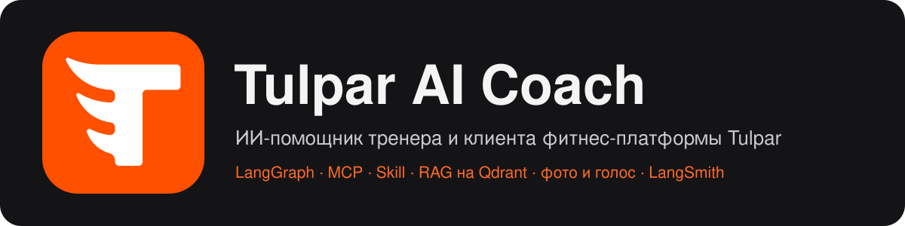
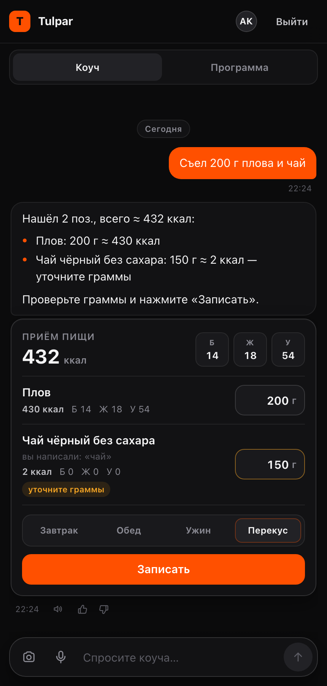
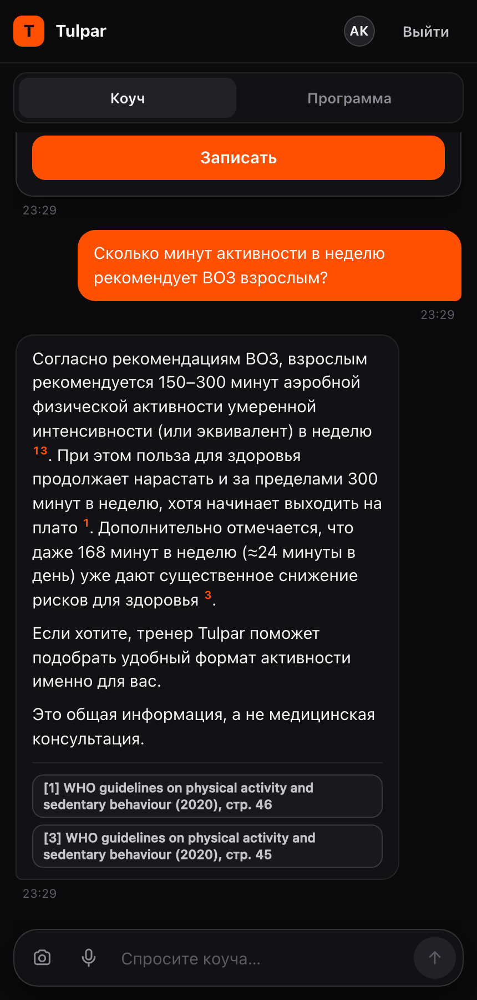
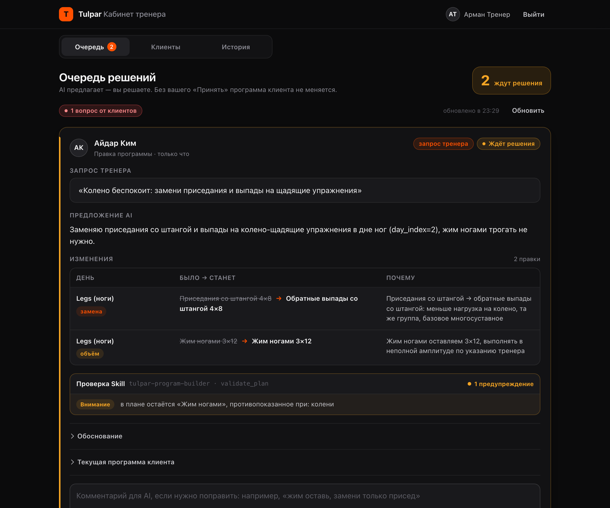
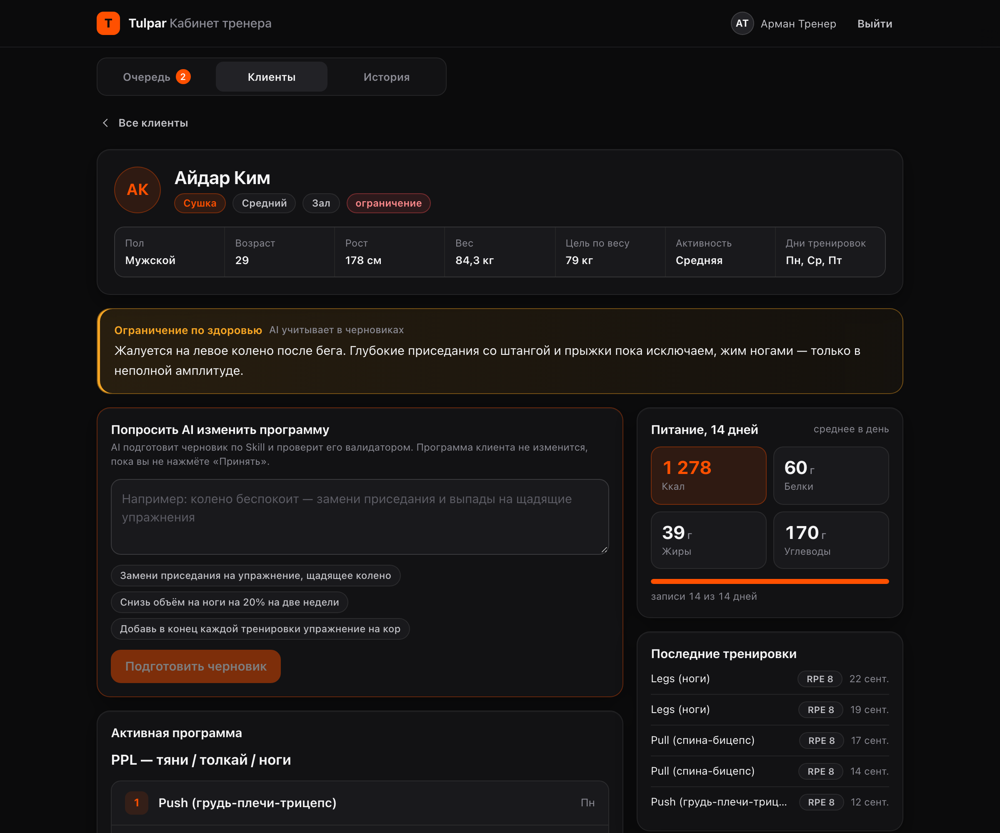
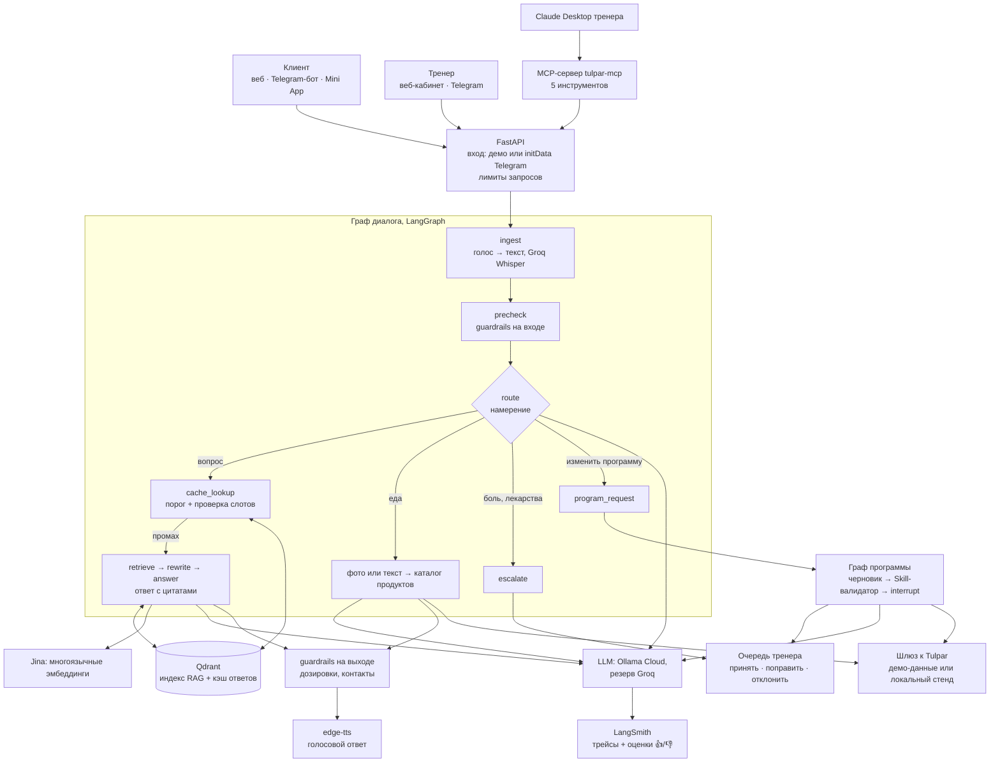

<p align="center"></p>

<p align="center"><b>ИИ-помощник тренера: отвечает клиентам по источникам, ведёт дневник питания и готовит правки программы, которые принимает тренер.</b></p>

<p align="center">
  <a href="https://coach-production-18ca.up.railway.app">Демо</a> ·
  <a href="https://t.me/TulparFitnessBot">Telegram-бот</a> ·
  <a href="https://github.com/DevLuigiGit/tulpar-ai-coach/wiki">Wiki</a> ·
  <a href="ARCHITECTURE.md">Архитектура</a> ·
  <a href="EVALS.md">Оценка качества</a>
</p>

Финальный проект курса nFactorial по LLM-инженерии. AI-слой поверх фитнес-платформы [Tulpar](https://tulpar-664.pages.dev): код Tulpar не менялся, связь с ним идёт через один шлюз.

## О проекте

Tulpar AI Coach — ИИ-помощник тренера и его клиентов. Клиент пишет ему в Telegram или в веб-приложении так же, как своему тренеру. Коуч подскажет технику упражнения и ответит на вопросы о питании со ссылкой на источник. По фото тарелки или голосовому он посчитает калории и запишет приём пищи в дневник. На просьбу изменить программу коуч подготовит черновик с учётом травм, уровня и доступного инвентаря, а тренер примет его одним нажатием. Жалобы на боль и другие тревожные сообщения коуч сам не обсуждает, а сразу передаёт тренеру.

**Для кого.** Для тренеров, которые ведут клиентов в мессенджерах, и для их клиентов. Тренер пользуется веб-кабинетом, Telegram или Claude Desktop, клиент — Telegram-ботом (в том числе как Mini App) или веб-приложением.

**Какая боль.**
- Тренер тратит время на однотипные вопросы: что съесть, чем заменить упражнение, сколько нужно активности.
- Клиенты бросают дневник питания, потому что вбивать еду руками долго.
- Сообщение о боли легко пропустить среди обычной переписки.
- Сейчас эти задачи решают перепиской в мессенджерах, таблицами и отдельными счётчиками калорий, и ничто из этого не связано с программой, которую ведёт тренер.

## Команда

Алексей — [@DevLuigiGit](https://github.com/DevLuigiGit)

Мадина — [@Madinkaa](https://github.com/Madinkaa)

## Что умеет

| Сценарий | Как работает |
|---|---|
| Фото еды → калории | vision-модель узнаёт блюда, КБЖУ на 100 г берутся из каталога Tulpar на 1305 продуктов. Вес берётся из подписи к фото, иначе ставится 150 г по умолчанию, и карточка просит уточнить граммы. Клиент поправляет граммы и записывает приём пищи в дневник |
| Голосовое или текст «съел 200 г плова и чай» | распознавание речи (Groq Whisper) → извлечение продуктов → та же карточка еды |
| Вопрос о технике, питании, нормах | RAG по 196 карточкам упражнений, правилам питания Tulpar и рекомендациям ВОЗ 2020. В ответе есть цитаты, для PDF ВОЗ — с номером страницы |
| Голосовой ответ | на голосовое бот отвечает голосом, в вебе под ответом есть кнопка «Прослушать ответ». Озвучка через edge-tts, для ответа на казахском голос выбирается автоматически |
| Повторный вопрос | семантический кэш в Qdrant отвечает без вызова LLM. Порог 0,95 и лексическая проверка слотов (пол, единица времени, можно / нельзя / нужно, числа и др.) не дают выдать ответ на похожий, но другой вопрос |
| Боль, травма, лекарства, беременность | модель не отвечает: сообщение уходит в очередь тренера, клиент получает безопасный текст |
| Защита (guardrails) | до модели фильтр отсекает инъекции, запросы чужих данных и грубость, красные флаги сразу уходят тренеру. После модели фильтр блокирует дозировки лекарств и маскирует контакты. На публичных эндпоинтах действуют лимиты запросов (HTTP 429) |
| «Тренер знает про колено, замените присед на что-то щадящее» | граф программы: черновик правок по Skill → валидатор → очередь тренера → «Принять / Поправить / Отклонить» |
| 👍/👎 под ответами | в вебе и в боте. Оценка сохраняется в сервисе и уходит в LangSmith к трейсу ответа. Ответы с 👎 выгружаются кандидатами в golden-набор (`tools/export_feedback.py`) |
| Кабинет тренера (веб) | «Очередь» — черновики и эскалации; «Клиенты» — профиль, ограничения, питание за 14 дней, последние тренировки, запрос черновика у AI, оценки 👍/👎; «История» — принятые, отклонённые и закрытые решения |
| Telegram Mini App | кнопка меню «Открыть» и кнопка «Открыть приложение» под `/start` открывают то же веб-приложение. Экрана входа нет: вход по подписанным `initData` Telegram |
| Claude Desktop тренера | MCP-сервер `tulpar-mcp` с пятью инструментами: клиенты, контекст клиента, поиск упражнений, черновик изменения, очередь. Применить изменение через MCP нельзя, это делает только человек |

## Как это выглядит

| Клиент: еда текстом или по фото → калории из каталога | Клиент: ответ со ссылками на страницы ВОЗ |
|---|---|
|  |  |

**Тренер: черновик изменения программы от AI, проверка Skill и решение тренера**



**Тренер: карточка клиента — ограничение по здоровью, питание за 14 дней, запрос черновика у AI**



Остальные экраны лежат в [`docs/screenshots/`](docs/screenshots/).

## Архитектура



Главный принцип: **агент предлагает, человек решает**. Изменение программы ждёт тренера в `interrupt()` LangGraph, и эта пауза переживает перезапуск сервиса: состояние хранит SQLite-чекпоинтер. Qdrant на Railway работает во встроенном режиме на volume, а в `docker compose` — отдельным сервером (`QDRANT_URL`), без правки кода.

Путь одного запроса, решения и альтернативы, компромиссы описаны в [ARCHITECTURE.md](ARCHITECTURE.md).

## Качество в цифрах

Маршрутизатор, RAG, валидатор и guardrails перепроверены итоговыми прогонами на коде после слияния всех веток (RAG — после исправления правил питания, вывод 22), остальные строки взяты из последних замеров. Подробности, эксперименты и ограничения метрик — в [EVALS.md](EVALS.md).

| Что проверяем | Набор | Результат | Файл |
|---|---|---|---|
| Маршрутизатор: верный маршрут / пойманы опасные / лишние эскалации | 66 сообщений, из них 18 опасных | 100% / 100% / 0% | [`router_final_merged.json`](evals/results/router_final_merged.json) |
| RAG: нужный источник среди 4 фрагментов (hit@4) / MRR | 51 вопрос с ответом в корпусе | 88,2% / 0,806 | [`qa_final_nutrition_rules.json`](evals/results/qa_final_nutrition_rules.json) |
| Ответы: ответил, когда ответ есть / ключевые факты на месте | 51 вопрос с ответом в корпусе | 92,2% / 86,3% | [`qa_final_nutrition_rules.json`](evals/results/qa_final_nutrition_rules.json) |
| Верность источникам / правильность (LLM-судья, 1–5) | 47 ответов, судья `deepseek-v4.1-flash` оценил все | 4,53–4,70 / 4,47–4,55 (два прогона 25.09) | [`qa_final_nutrition_rules.json`](evals/results/qa_final_nutrition_rules.json), [`qa_final_merged.json`](evals/results/qa_final_merged.json) |
| Вопросы без ответа в корпусе переданы тренеру | 5 вопросов | 100% | [`qa_final_nutrition_rules.json`](evals/results/qa_final_nutrition_rules.json) |
| Фото еды: главное блюдо названо верно (top-1) | 80 фото | 72,5% | [`vision_kimi-k2.7-code.json`](evals/results/vision_kimi-k2.7-code.json) |
| Валидатор Skill: найденные ошибки совпадают с ожидаемыми | 13 случаев | 100% | [`program.json`](evals/results/program.json) |
| Черновики программ проходят валидатор: сразу / после цикла исправлений | 9 запросов | 77,8% / 100% | [`draft_v2.json`](evals/results/draft_v2.json) |
| Guardrails на входе: точность / ложные срабатывания на безобидных | 209 сообщений, из них 93 безобидных | 98,6% / 0% | [`guardrails.json`](evals/results/guardrails.json) |
| Guardrails на выходе | 23 ответа | 100% | [`guardrails.json`](evals/results/guardrails.json) |
| Кэш ответов: ошибочные ответы с проверкой слотов / только с порогом | 126 пар вопросов | 0 / 16; перефразы попадают в кэш в 22,7% случаев | [`cache.json`](evals/results/cache.json) |
| Согласие трёх LLM-судей разных семейств: все согласны по pass/fail / разброс pass% | 44 ответа | 93,2% / не больше 2,3 п. п.; каппа Флейса 0,675 (correctness) и 0,227 (faithfulness) | [`judge_agreement.json`](evals/results/judge_agreement.json) |
| Стоимость вопроса с поиском и ответом (по ценам Groq) | 56 вопросов | $0,00083 | [`qa_final_merged.json`](evals/results/qa_final_merged.json) |
| Задержка: маршрут p50 / вопрос p50 и p95 | прогоны выше | 1,39 с / 2,8–3,0 с и 5,8–7,1 с | [`router_final_merged.json`](evals/results/router_final_merged.json), [`qa_final_merged.json`](evals/results/qa_final_merged.json) |
| Задержка: повтор из кэша / полный путь вопроса (p50, без маршрута) | 10 вопросов | 0,48 с / 2,6 с, 0 вызовов LLM при попадании | [`cache.json`](evals/results/cache.json) |
| Озвучка ответа: p50 / p95, медианный размер MP3 | 20 вызовов | 1,7 с / 7,0 с, 77,7 КиБ | [`tts.json`](evals/results/tts.json) |

Честно о цифрах:
- Промпт маршрутизатора v2 правился по провалам того же набора, поэтому 100% — оценка сверху.
- На отложенном срезе guardrails, написанном после первой настройки, точность 89,3% (28 сообщений).
- Faithfulness и correctness ставит LLM-судья. 25.09 Ollama Cloud сняла прежнего судью `qwen3.5:397b`, новый основной — `deepseek-v4.1-flash`, выбранный по замеру согласия трёх судей. Faithfulness ниже, чем до слияния (4,93), но тогда оценки ставил резервный судья и не на всех ответах; разбор — вывод 21 в [EVALS.md](EVALS.md). Согласие судьи с человеком ещё не измерено: выборка из 10 ответов для ручной разметки лежит в [`evals/human/`](evals/human/).
- Ollama Cloud в продукте работает по подписке, поэтому стоимость посчитана по токенам в ценах аналога у Groq.

## Обязательные модули курса

| Требование | Где в коде |
|---|---|
| LangGraph: ветвления, циклы, human-in-the-loop | `tulpar_ai/graph/chat.py`: маршрут на семь направлений, кэш, цикл `retrieve → rewrite`. `tulpar_ai/graph/program.py`: цикл `draft → validate`, пауза `interrupt()` на решение тренера. Чекпоинтер — `tulpar_ai/graph/runner.py` |
| Собственный MCP-сервер | `tulpar_ai/mcp_server/server.py` (5 инструментов), конфиг `mcp/claude_desktop_config.example.json`, транскрипт [docs/mcp-demo.md](docs/mcp-demo.md) |
| Собственный Skill | `skills/tulpar-program-builder/SKILL.md`, справочники `references/`, валидатор `scripts/validate_plan.py`. Граф и Claude используют одни и те же файлы |
| RAG | `tulpar_ai/rag/`: `index.py`, `retrieve.py`, `embed.py` (Jina или локальный запасной вариант), `qdrant.py`. Обоснование решений — раздел RAG в [ARCHITECTURE.md](ARCHITECTURE.md) |
| Обработка документов | пакет [`parsing/`](parsing/README.md): pypdfium2 читает PDF постранично, python-docx — DOCX, дальше очистка и нарезка с перекрытием. Корпус — `corpus/`. Бэкенды PDF сравнены в `evals/parsing_backends.py` |
| Мультимодальность | фото еды (`tulpar_ai/graph/chat.py`), голос → текст (`tulpar_ai/stt.py`), текст → голос (`tulpar_ai/tts.py`) |
| LangSmith | трейсы всех вызовов LLM, ретривера, инструментов и голоса, проект `tulpar-ai-coach`. Оценки 👍/👎 привязаны к трейсу (`tulpar_ai/feedback.py`) |
| Golden dataset, метрики, A/B, гиперпараметры | `evals/golden/`, `evals/run.py`, [EVALS.md](EVALS.md), история промптов — `tulpar_ai/prompts/CHANGELOG.md` |
| Фронтенд | `web/` (Vite + React): чат клиента и кабинет тренера, это же приложение открывается как Mini App. Telegram-бот — `tulpar_ai/bot/` |

### Дополнительно

| Что | Где |
|---|---|
| Guardrails без LLM: фильтры входа и выхода, лимиты запросов | `tulpar_ai/guardrails.py`, `tulpar_ai/api/ratelimit.py`, `evals/guardrails_eval.py` |
| Семантический кэш ответов с лексической проверкой слотов | `tulpar_ai/rag/answer_cache.py`, `tulpar_ai/rag/cache_guard.py`, `evals/cache_eval.py` |
| Резервные модели (fallback) | `tulpar_ai/llm.py`: цепочки моделей по ролям в `.env`. Если недоступны все модели, маршрут строится по правилам, а вопросы уходят тренеру |
| Docker | `Dockerfile` (веб и API в одном контейнере), `docker-compose.yml` (сервис и Qdrant) |
| Евалы в CI | `.github/workflows/ci.yml` на каждом pull request: тесты и валидатор, а при наличии ключей ещё маршрутизатор и RAG. Ключи в секреты GitHub кладёт `tools/github_secrets.sh` |
| Деплой на Railway | `railway.json`, `tools/railway_keys.sh` |
| Авторизация и роли | `tulpar_ai/api/auth.py`: JWT сервиса с ролями «клиент» и «тренер», общий секрет для MCP. `tulpar_ai/api/telegram_auth.py`: вход Mini App по `initData` |
| Голос в обе стороны | `tulpar_ai/stt.py`, `tulpar_ai/tts.py`, замер `evals/tts_bench.py` |
| Свой фреймворк оценки | `evals/run.py`, `evals/report.py`, согласие судей `evals/judge_agreement.py`, набор для ручной разметки `evals/human/` |
| Внешние API | Telegram Bot API и Mini App (`tulpar_ai/bot/`), Ollama Cloud, Groq, Jina, LangSmith, edge-tts |
| Маскирование персональных данных | `tulpar_ai/pii.py` маскирует телефон, e-mail и ИИН до вызова модели. Контекст клиента уходит в модель без имени (`ClientContext.for_llm` в `tulpar_ai/gateway/base.py`). Фото и голосовые попадают в трейсы только размером |

## Запуск

Нужны Python 3.12 и Node 22.

```bash
make install
cp .env.example .env
make run
```

Откройте http://localhost:8089 и войдите демо-клиентом или демо-тренером. Сервис стартует и без ключей: маршрут строится по правилам, поиск идёт на локальных эмбеддингах, а вопросы без модели уходят тренеру. Для полной работы впишите ключи в `.env` и проверьте их (сами ключи команда не печатает):

```bash
make keys
```

| Команда | Что делает |
|---|---|
| `make test` | тесты без сети и ключей (фейковая LLM) |
| `make evals` | евалы: валидатор, маршрутизатор, RAG |
| `make mcp` | MCP-сервер для Claude Desktop (сервис должен быть запущен) |
| `docker compose up --build` | сервис на http://localhost:8089 и Qdrant с дашбордом на http://localhost:6333/dashboard. Telegram-бот в контейнере выключен |
| `python tools/demo_scenario.py --base http://localhost:8089` | сквозной сценарий защиты: вопрос, еда, запрос на изменение программы, решение тренера, трейсы в LangSmith ([docs/demo-scenario.md](docs/demo-scenario.md)) |
| `python tools/export_feedback.py` | ответы с 👎 → кандидаты в golden-набор |
| `make export` | заново выгрузить демо-данные и корпус из локального репозитория Tulpar (только чтение) |

**Режимы.** `TULPAR_MODE=demo` (по умолчанию): демо-тренер и два демо-клиента, их программы и дневник хранятся в самом сервисе. `TULPAR_MODE=tulpar`: работа с локальным стендом Tulpar через его API. Адрес прода запрещён проверкой при старте.

**Telegram.** Впишите токен бота в `TELEGRAM_BOT_TOKEN`, а свой числовой ID в `TRAINER_TELEGRAM_IDS`, тогда бот будет считать вас тренером. Токен опрашивает только один процесс, поэтому бот запускается либо локально, либо на Railway.

**Mini App.** Telegram открывает только https-адреса. Кнопки «Открыть» и «Открыть приложение» появляются, когда задан `WEBAPP_URL`, а на Railway адрес берётся из `RAILWAY_PUBLIC_DOMAIN`. Локально без https кнопок нет. Веб-приложение само входит по `initData` (`POST /api/auth/telegram`): подпись проверяется по токену бота, срок жизни задаёт `TELEGRAM_AUTH_MAX_AGE_S`.

**Claude Desktop.** Скопируйте блок из `mcp/claude_desktop_config.example.json` в конфиг Claude Desktop, поправьте пути и `INTERNAL_SECRET`, перезапустите приложение. Пример работы с инструментами — [docs/mcp-demo.md](docs/mcp-demo.md).

## Деплой на Railway

Проект Railway отдельный, это не проект Tulpar. Сервис собирается по `Dockerfile`, веб и API работают в одном контейнере в одном экземпляре, healthcheck `/health` задан в `railway.json`.
- Volume смонтирован в `/data` (`AI_DATA_DIR=/data`). Там лежат SQLite с очередью и чекпоинтами и встроенный Qdrant с индексом RAG и кэшем ответов.
- Переменные берутся из `.env.example`. `JWT_SECRET` и `INTERNAL_SECRET` должны быть длинными случайными строками: со значениями по умолчанию сервис на Railway не стартует.
- Ключи из локального `.env` переносит `bash tools/railway_keys.sh`. С флагом `--bot` он переносит и токен бота.
- На Railway работает демо-режим.

## Структура репозитория

```
tulpar_ai/          сервис
  api/              FastAPI: вход (демо, Telegram initData), лимиты запросов
  graph/            графы LangGraph: диалог и изменение программы
  rag/              индекс Qdrant, эмбеддинги, поиск, кэш ответов
  bot/              Telegram-бот и кнопки Mini App
  mcp_server/       MCP-сервер tulpar-mcp
  gateway/          шлюз к Tulpar: демо-данные или локальный стенд
  prompts/          версии промптов и CHANGELOG
  guardrails.py     фильтры входа и выхода
  feedback.py       👍/👎 → LangSmith
  stt.py, tts.py    голос → текст, текст → голос
parsing/            разбор PDF и DOCX: pypdfium2, python-docx, очистка, нарезка
skills/             Skill tulpar-program-builder с валидатором
corpus/             корпус RAG и источники (SOURCES.md)
fixtures/           демо-данные из сидов Tulpar
evals/              golden-наборы, раннеры, результаты, ручная разметка (human/)
web/                веб-приложение (Vite + React), оно же Mini App
tests/              тесты
tools/              сценарий защиты, MCP-демо, выгрузки, перенос ключей
docs/               скриншоты, сценарий защиты, MCP-демо, логотип и баннер
mcp/                пример конфига Claude Desktop
```

## Что дальше

1. Пилот с тренерами Tulpar: реальный режим работы с Tulpar вместо демо-данных, сбор решений тренеров «принять / поправить / отклонить».
2. Отложенный golden-набор из реальных сообщений клиентов и ответов с 👎. Это честная проверка маршрутизатора и промптов, которые правились по текущему набору.
3. Ручная разметка ответов в `evals/human/`, чтобы измерить согласие LLM-судьи с человеком.
4. Разметка противопоказаний и инвентаря для всех 196 упражнений каталога: сейчас противопоказания заполнены у 43.
5. Postgres вместо SQLite и общие лимиты запросов для нескольких экземпляров сервиса; OAuth вместо общего секрета для MCP.
6. Оценка граммов по фото: сейчас вес уточняет клиент.
7. Кэш: подмены, которых нет в списках слотов (хват, подходы / повторения), сейчас отсекает только порог.
8. Когда накопятся решения тренеров, дообучить модель черновиков на принятых правках.

## Лицензии данных

- `corpus/who_2020_physical_activity.pdf` — WHO guidelines on physical activity and sedentary behaviour, 2020, © World Health Organization. Лицензия CC BY-NC-SA 3.0 IGO: документ используется некоммерчески и с указанием авторства.
- `corpus/exercises.jsonl` (собственность проекта Tulpar), `corpus/nutrition.md` и демо-данные в `fixtures/` взяты из сидов и документации Tulpar. Реальных людей в демо-данных нет.
- Бенчмарк из 80 фото еды в репозиторий не входит, потому что это чужие снимки.
- PyMuPDF (AGPL-3.0) заменён на pypdfium2 (Apache-2.0 / BSD-3-Clause).

Подробно об источниках — [corpus/SOURCES.md](corpus/SOURCES.md).
