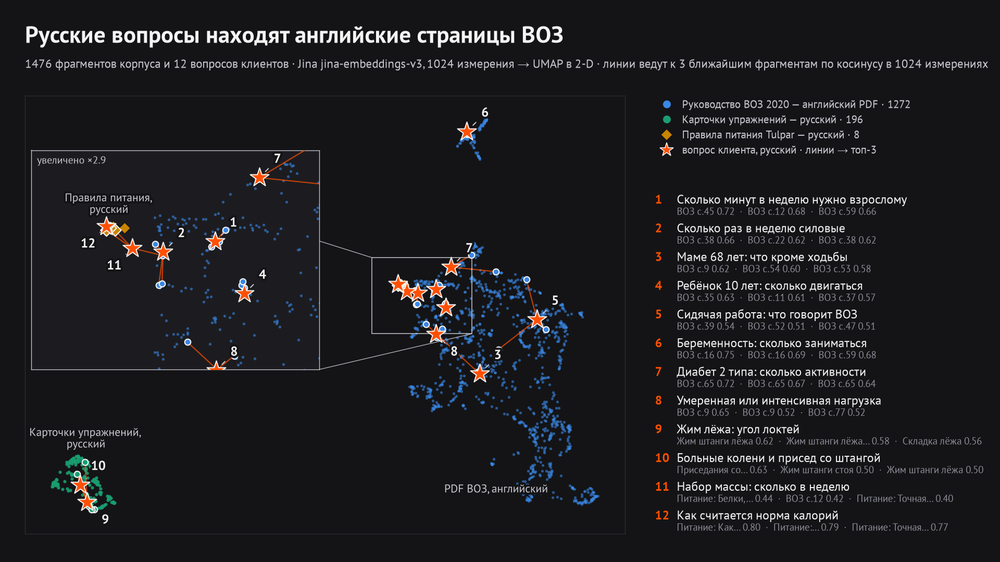
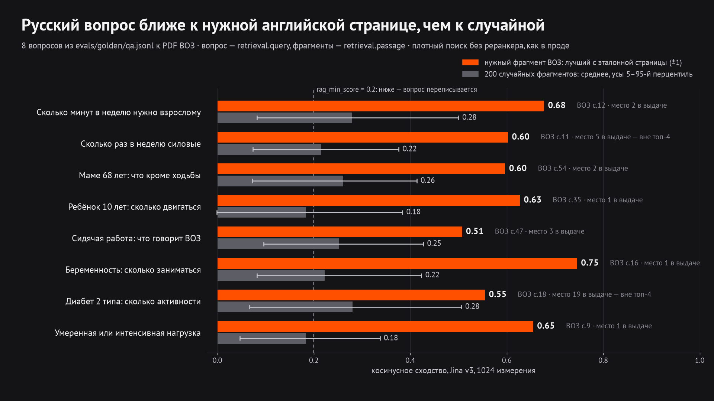

# RAG: эмбеддинги и варианты поиска

## Карта эмбеддингов

1476 фрагментов корпуса (1272 — английский PDF ВОЗ 2020, 196 карточек упражнений, 8 разделов правил питания) и 12 русских вопросов клиентов в векторах `jina-embeddings-v3` (1024 измерения), спроецированы UMAP в 2-D. Линии ведут к трём ближайшим фрагментам по косинусу **в исходных 1024 измерениях**, а не на плоскости. Видно главное: русские вопросы о нормах активности попадают в облако английских страниц ВОЗ, вопросы о технике — к русским карточкам упражнений, вопросы о калориях — к правилам питания.

Для 8 вопросов из `evals/golden/qa.jsonl` к PDF ВОЗ: косинус русского вопроса с лучшим фрагментом эталонной страницы — 0,51–0,75, со случайными фрагментами — в среднем 0,18–0,28. Два вопроса из восьми при этом не попадают в топ-4 (места 5 и 19): рядом есть другие близкие страницы.

Ограничения: 2-D проекция искажает расстояния, поэтому по картинке нельзя судить о качестве поиска — это делают метрики ниже. Пересобрать: `.venv/bin/python evals/embedding_map.py` (векторы корпуса берутся из существующего индекса, Jina вызывается только для 12 вопросов).

## Варианты поиска: A/B на двух наборах

`evals/retrieval_eval.py` + `evals/rag_variants_plugin.py`, результат — `evals/results/rag_matrix.json`. Наборы: `retrieval_synth.jsonl` — 174 **синтетических** вопроса (их написала `deepseek-v4.1-flash` к конкретным фрагментам, проверила `kimi-k2.6`; 99 — к PDF ВОЗ) и 51 вопрос `qa.jsonl`, у которого есть ответ в корпусе. Метрики с 95% бутстреп-интервалами, сравнение с базой — тест Макнемара по hit@4.

| Вариант | hit@1 синт. | hit@4 синт. | Recall@10 синт. | MRR синт. | hit@4 qa | Итог против базы |
|---|---|---|---|---|---|---|
| **База: Jina v3, 1024, без реранкера** | 50,6 | **69,5** [62,6–75,9] | 74,8 | 0,597 | 88,2 | — |
| Matryoshka 512 | 51,1 | 69,0 | 74,6 | 0,599 | 88,2 | то же при вдвое меньшем векторе (p = 1,0) |
| Matryoshka 256 | 50,0 | 67,8 | 73,7 | 0,586 | 88,2 | чуть хуже, незначимо (p = 0,45) |
| Гибрид: плотный + BM25, RRF | **54,0** | 63,8 | 71,4 | 0,601 | 86,3 | top-1 лучше, hit@4 значимо хуже (p = 0,03) |
| Контекстные заголовки | 48,3 | 64,9 | 71,3 | 0,563 | 82,3 | хуже (p = 0,08) |
| Запрос + перевод на английский, RRF | 46,6 | 67,8 | 77,3 | 0,573 | 82,3 | шире охват, ниже точность (p = 0,63) |
| Гибрид + перевод | 44,2 | 68,4 | **78,9** | 0,569 | 86,3 | лучший Recall@10, hit@4 не выше базы |
| Late chunking (окна по 3 страницы) | 39,1 | 54,6 | 54,4 | 0,468 | 84,3 | сильно хуже |

**Вывод.** Ни одно из семи «улучшений» не обыграло плотный поиск Jina на главной метрике hit@4, поэтому база остаётся в продукте. Matryoshka 512 даёт то же качество при вдвое меньшем индексе — это вариант для роста корпуса. Гибрид с BM25 чаще ставит нужный фрагмент первым, но выталкивает другие релевантные из топ-4. Перевод запроса расширяет охват (Recall@10), но стоит лишнего вызова LLM и снижает точность. Late chunking в нашей реализации сильно просел — вероятная причина в группировке фрагментов по окнам страниц; вывод «не помогает» к нему применим только с этой оговоркой.

**Чего эти цифры не показывают.** Синтетические вопросы часто повторяют слова фрагмента, поэтому оптимистичны для лексического поиска; 51 ручной вопрос даёт широкие интервалы (hit@4 88,2%, 95% ДИ 78,4–96,1). База на синтетике (69,5%) заметно ниже, чем на ручном наборе (88,2%): вопросы к конкретному фрагменту PDF строже, чем вопросы с эталонной страницей.

Все варианты включаются настройками (`RAG_EMBED_DIM`, `RAG_HYBRID`, `RAG_CONTEXT_HEADERS`, `RAG_MULTI_QUERY`, `RAG_LATE_CHUNKING`), по умолчанию выключены; имя коллекции Qdrant меняется вместе с вариантом, поэтому прод не смешивает схемы.
